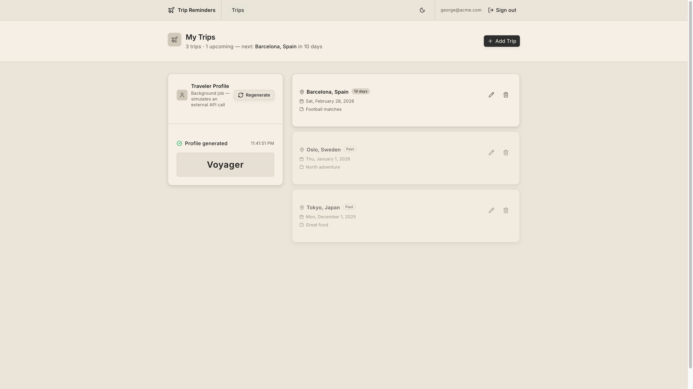

# Trip Reminders

A full-stack application for managing trip reminders, built with Ruby on Rails, TanStack Start, and Sidekiq.



## Overview

This project demonstrates a complete application using:
- **Rails API** — RESTful backend with PostgreSQL, token-based authentication, and background jobs
- **TanStack Start** — Full-stack React framework with file-based routing, SSR, and TypeScript
- **Sidekiq** — Background job processing (traveler profile generation)
- **shadcn/ui** — Accessible component library built on Radix UI and Tailwind CSS

Users can register, sign in, and manage trip reminders. A background job showcase generates an AI-style "traveler type" profile for each user.

## Project Structure

```
.
├── docker-compose.yml              # Infrastructure (PostgreSQL, Redis)
├── api/                            # Rails API backend
│   ├── app/
│   │   ├── controllers/            # REST API endpoints + auth concern
│   │   ├── models/                 # User, Trip
│   │   └── jobs/                   # GenerateTravelerProfileJob
│   ├── config/
│   │   ├── initializers/           # CORS config
│   │   └── routes.rb               # API routes + Sidekiq Web UI
│   └── db/
│       └── migrate/                # Database migrations
│
└── web/                            # TanStack Start frontend
    ├── src/
    │   ├── api/                    # Typed API clients (auth, trips, profile)
    │   ├── components/
    │   │   ├── header.tsx          # App header
    │   │   └── ui/                 # shadcn/ui components
    │   ├── routes/
    │   │   ├── __root.tsx          # Root layout
    │   │   ├── index.tsx           # Trips dashboard
    │   │   ├── signin.tsx          # Sign in page
    │   │   └── signup.tsx          # Sign up page
    │   └── styles.css
    ├── vite.config.ts
    └── package.json
```

## Prerequisites

- Ruby 3.4.8
- Docker and Docker Compose
- Node.js (v18+)

## Quick Start

### 1. Start Infrastructure

Start PostgreSQL and Redis using Docker Compose:

```bash
docker-compose up -d
```

This starts:
- **PostgreSQL** on port 5432
  - Database: `api_development`
  - User: `api`
  - Password: `api_dev`
- **Redis** on port 6379

### 2. Backend Setup

```bash
cd api

# Install dependencies
bundle install

# Set up database
rails db:create
rails db:migrate

# Start Rails server (terminal 1) — runs on port 3000
rails s

# Start Sidekiq worker (terminal 2)
bundle exec sidekiq
```

The API will be available at `http://localhost:3000`.

**Sidekiq Web UI**: Visit `http://localhost:3000/sidekiq` (login: `admin` / `admin`) to monitor background jobs.

### 3. Frontend Setup

```bash
cd web

# Install dependencies
npm install

# Start development server — runs on port 5173
npm run dev
```

The frontend will be available at `http://localhost:5173`.

## Usage

1. Open the app at `http://localhost:5173`
2. **Sign up** with an email and password
3. Click **Add Trip** to create a trip (destination, date, optional notes)
4. View all trips — upcoming trips are sorted first, past trips below
5. Edit or delete trips with the action icons on each card
6. Generate your **Traveler Profile** — a background job assigns you a traveler type (e.g. adventurer, nomad, globetrotter)

## API Endpoints

### Authentication

- `POST /signup` — Register a new user
  ```json
  { "user": { "email": "you@example.com", "password": "secret123", "password_confirmation": "secret123" } }
  ```
  Returns: `{ "token": "...", "email": "..." }`

- `POST /signin` — Authenticate an existing user
  ```json
  { "email": "you@example.com", "password": "secret123" }
  ```
  Returns: `{ "token": "...", "email": "..." }`

All endpoints below require the token in the `Authorization` header:
```
Authorization: <token>
```

### Trips

- `GET /trips` — List all trips for the current user (upcoming first)
- `POST /trips` — Create a new trip
  ```json
  { "trip": { "destination": "Paris, France", "trip_date": "2026-06-15", "notes": "Visiting the Eiffel Tower" } }
  ```
- `GET /trips/:id` — Get a specific trip
- `PATCH /trips/:id` — Update a trip
- `DELETE /trips/:id` — Delete a trip

### Traveler Profile

- `POST /traveler_profile/generate` — Enqueue a background job to generate the user's traveler type
- `GET /traveler_profile/status` — Poll the job status (`idle` → `running` → `complete`)

## Environment Variables

Create `api/.env` with the following variables:

**Backend:**
- `REDIS_URL` — Redis connection URL (default: `redis://localhost:6379/0`)
- `DATABASE_HOST` — PostgreSQL host (default: `localhost`)
- `DATABASE_PORT` — PostgreSQL port (default: `5432`)

**Frontend:**

The API base URL is configured in `src/api/trips.ts` (default: `http://localhost:3000`).

### Stopping Infrastructure

```bash
# Stop services
docker-compose down

# Stop and remove volumes (clears all data)
docker-compose down -v
```

## Technologies Used

- **Ruby on Rails 8.1** — API framework
- **PostgreSQL** — Database
- **Solid Queue / Cache / Cable** — Rails 8 database-backed adapters
- **Sidekiq** — Background job processing
- **bcrypt** — Password hashing (`has_secure_password`)
- **rack-cors** — CORS handling
- **RSpec + Rswag** — Testing and OpenAPI documentation
- **TanStack Start** — Full-stack React framework (SSR, file-based routing)
- **TanStack Router** — Type-safe client-side routing
- **React 19** — UI library
- **TypeScript** — End-to-end type safety
- **Tailwind CSS v4** — Styling
- **shadcn/ui** — Component library (Radix UI primitives)
- **Vitest** — Frontend unit testing
- **Vite** — Build tool
